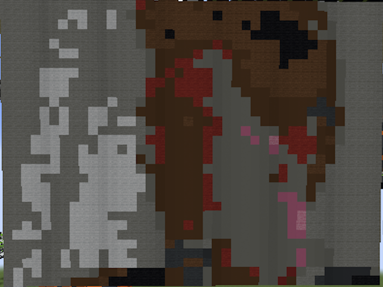

## Videos

`video-mc.cpp`
> Requires ffmpeg installed

### Usage

Using ffmpeg, convert an mp4 to a rgb file. To do so run `ffmpeg -i filename.mp4 -f rawvideo -pix_fmt rgb24 filename.rgb`

Run `./video-mc filename.rgb width height scale frame_rate`

> Scale is used to divide the image size

### Examples

`./video-mc rick-roll.rgb 640 480 16 24`

`./video-mc bad-apple.rgb 320 240 5 30`

YouTube video:

